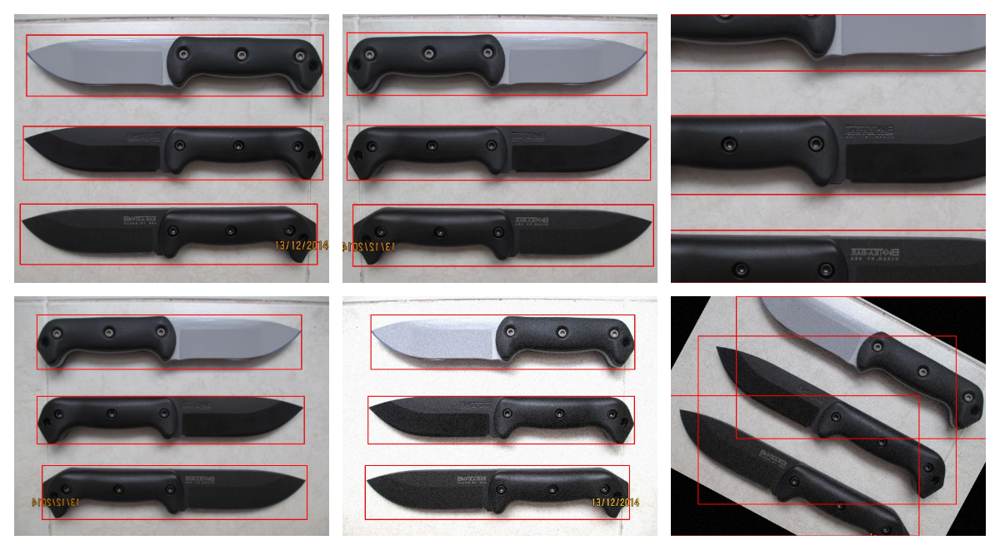

# Pascal VOC Image Augmentor

Script for image augmentation writing new Pascal VOC annotations, using the [imgaug library](https://github.com/aleju/imgaug).  

Augment images present in `dataset/images/` considering their **Pascal VOC** annotations in `dataset/annotations/`. This library is useful AFTER you've annotated your images with a tool such as [labelImg](https://github.com/tzutalin/labelImg).

:information_source: This script was designed to consume a low amount of RAM. Images are processed **one by one**.

## Usage

1. Place your images in `dataset/images/` and their associated annotations in `dataset/annotations/`

    > The image filenames must match their annotation filenames.

2. Configure the augmentation options as you wish in `docker-compose.yml`

3. Run the script

    ```bash
    docker-compose up augment
    ```

## Visualize

You can run the following command then to visualize newly annotated images that were copied in `dataset-augmented/`

A red square will be drawn around the bounding boxes described in the annotations

Images will be saved into `dataset-visualization/`

```bash
docker-compose up visualize
```

Here is an example :



> Top left you can see the original image, and then the augmented images. You can customize the augmentation parameters [in augment.py](./augment.py) at line **180**.

## References

1. Part of this project is an adaptation of the [asetkn's tutorial](https://github.com/asetkn/Tutorial-Image-and-Multiple-Bounding-Boxes-Augmentation-for-Deep-Learning-in-4-Steps/blob/master/Tutorial-Image-and-Multiple-Bounding-Boxes-Augmentation-for-Deep-Learning-in-4-Steps.ipynb) on how to perform image augmentation with Pascal VOC annotated images
